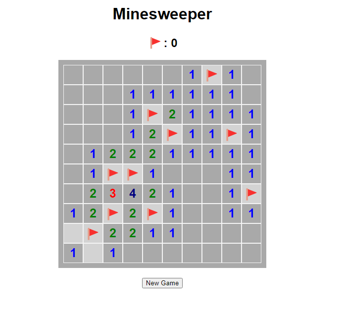

# Minesweeper Game

This project is a simple implementation of the classic Minesweeper game using HTML, CSS and Javascript.

## Gameplay

The objective of Minesweeper is to clear the board without detonating any mines. 

- Left-click on a tile to reveal its content.
- Right-click to place or remove a flag on a suspected mine.
- The numbers indicate how many mines are adjacent to that tile.
- If you click on a tile with a mine, you lose the game.
- If you reveal all tiles except the mines, you win.
- You can click on the New Game button below to start a new game.

## Screenshot

## How to Play

1. Clone this repository to your local machine.
2. Open the `index.html` file in your web browser.
3. Start playing Minesweeper!

## Credits

Special thanks to Kenny Yip Coding on Youtube for the lesson to create this game.

